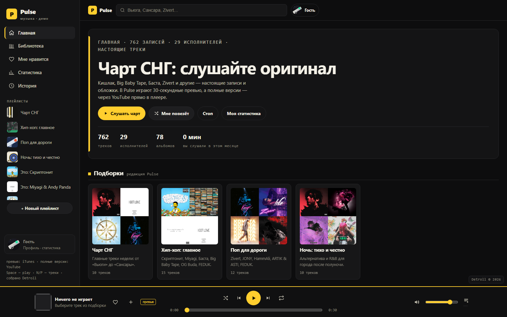

# Pulse — музыка СНГ каждый день

Каталог настоящих записей СНГ: **751 трек, 29 исполнителей, 78 альбомов** — Кишлак, Miyagi & Andy Panda, Баста, Скриптонит, Zivert, Big Baby Tape, Клава Кока, MORGENSHTERN и другие.



## Что это

Веб-приложение — музыкальный каталог с плеером, собранный как портфолио. Внутри:

- **Чарт и подборки** — топ-8 редакции и тематические плейлисты (хип-хоп, поп, ночь);
- **Библиотека** — все артисты, альбомы и плейлисты с обложками из Apple Music;
- **Плеер** — 30-секундные превью iTunes, очередь, шаффл, повтор, громкость, горячие клавиши (Space — play, N/P — треки);
- **Полные версии** — через YouTube IFrame API прямо в плеере или ссылкой;
- **Профиль и статистика** — аватар, топ артистов месяца, история прослушиваний;
- **Плейлисты** — редакционные, автосборки «Это: …» и свои (создание, переименование, удаление);
- **Свои файлы** — можно добавить локальные аудио (IndexedDB, никуда не уходят).

## Запуск

Без сборки и зависимостей — vanilla JS:

```bash
python -m http.server 8080
# открыть http://localhost:8080
```

Можно просто открыть `index.html` двойным кликом, но превью и обложки грузятся с внешних CDN, так что интернет нужен в любом случае.

## Публикация

Папка готова к GitHub Pages: относительные пути, `.nojekyll` на месте, OG-теги и `screenshot.png` для превью ссылок.

## Структура

```
index.html   — разметка (сайдбар, плеер, модалки)
styles.css   — тёмная тема, адаптив (560/860/1080/1600)
data.js      — каталог: 751 трек / 29 артистов / 78 альбомов (единственный источник данных)
app.js       — вся логика SPA (hash-роуты, рендер, состояние)
player.js    — аудио-движок (превью iTunes)
yt.js        — полные версии через YouTube IFrame API
art.js       — генеративные обложки/аватары (canvas)
favicon.svg  — иконка
docs/PULSE_PROJECT_MEMORY.md — техническая память проекта (архитектура, решения, история)
```

## Честность данных

Никаких выдуманных счётчиков и фейков: каталог собран из открытых источников (iTunes Search API — превью и обложки, Wikipedia — биографии), чарт задан редакцией, слушатели не рисуются. Полные версии — только легально: YouTube-ссылки и свои файлы.

---

Detroll © 2026. Портфолио.
