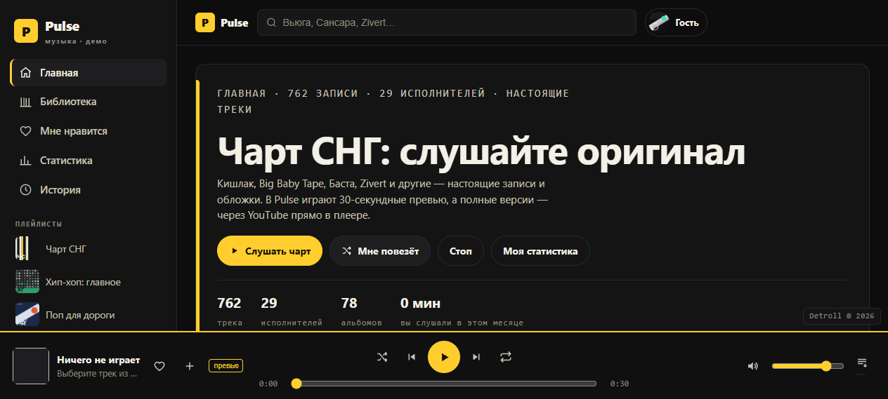

# Pulse — музыкальный сервис (СНГ-каталог)

> **Independent web project** — полноценный рабочий продукт.

Статический музыкальный сайт с реальным каталогом: **762 трека · 29 исполнителей · 78 альбомов**, собственным аудиоплеером и набором фич, как у настоящего музыкального сервиса.

**🔗 Live: https://detroll1.github.io/pulse**

---

## 01 — What it is
Каталог современной музыки СНГ (Кишлак, Miyagi, Баста, Zivert, Скриптонит и др.) в формате одиночного HTML/JS-приложения без бэкенда. Данные настоящие (собраны вручную + автоматически из открытых источников).

## 02 — Features
- **Плеер** — очередь, prev/next, перемотка, автоповтор, сохранение истории.
- **Поиск и фильтры** — по артистам, жанрам, названию.
- **Профили артистов** — описание + все их треки.
- **Плейлисты и чарт** — собираются из истории слушаний.
- **Аудио** — превью 30 сек через iTunes Search API; полные версии — YouTube-резолвер.

## 03 — Architecture
- `data.js` — реальный каталог (762/29/78), отделён от логики.
- `app.js` — роутинг вью (home/артисты/плейлисты), состояние, поиск.
- `player.js` — плеер и очередь. `yt.js` — резолвер полной версии трека через YouTube (с фолбэком на превью iTunes).
- **SPA без фреймворков** — hash-роутинг, рендер через innerHTML-шаблоны.

## 04 — UX decisions
- Space = play, N/P = следующие/предыдущие — полноценная клавиатурная навигация.
- Хранение слушаний в localStorage → история и плейлисты переживают перезагрузку.
- Адаптив до 360px; сниженное движение — `prefers-reduced-motion`.

## 05 — Performance
- Ноль зависимостей, ноль сборки — всё сжато и отдаётся с GitHub Pages.
- Картинки лениво грузятся, плеер стримит превью, а не тянет аудио целиком.

## 06 — Accessibility
- ARIA-атрибуты на плеере и навигации, фокус с клавиатуры, контраст.
- Всё оперируемо без мыши.

## 07 — Screenshots

## 08 — Live demo
https://detroll1.github.io/pulse

---

## 09 — Контакты
Telegram: [@Detroll](https://t.me/Detroll) · Email: detrollq@gmail.com · Discord: Detroll1

---
© Detroll · pulse